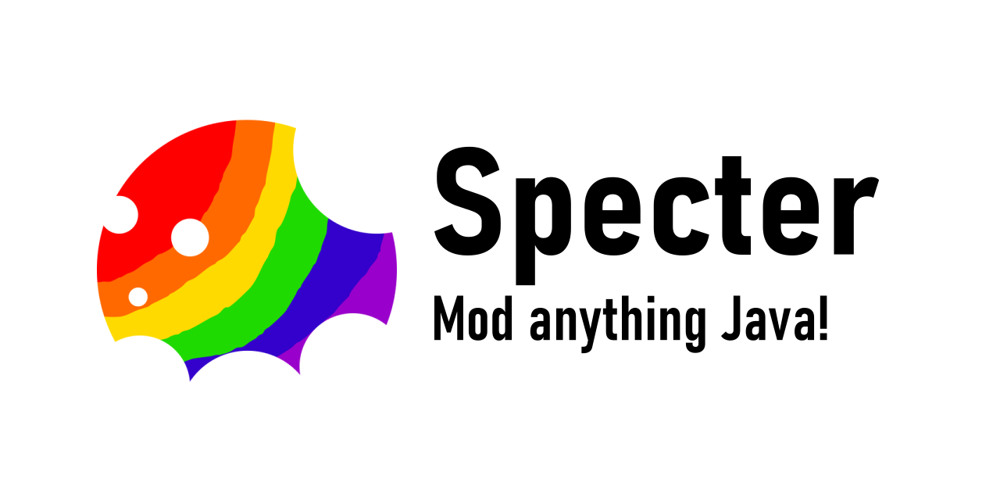

 

<!--

-->
---
Specter is a general-purpose mod loader for programs running on the Java virtual machine. Write scripts and tweak bytecode using Groovy&mdash;no JDK required! While primarily developed to mod Minecraft, Specter should work equally well with other programs. To get started, download Specter and add `-javaagent:/path/to/Specter.jar=/path/to/mods` to the JVM arguments of the program you want to modify.

**For more information, check out [the wiki](https://github.com/SianaBeeblebrox/Specter/wiki)!**

*Specter is not associated with Minecraft, Mojang, or any other third-party programs mentioned.*
